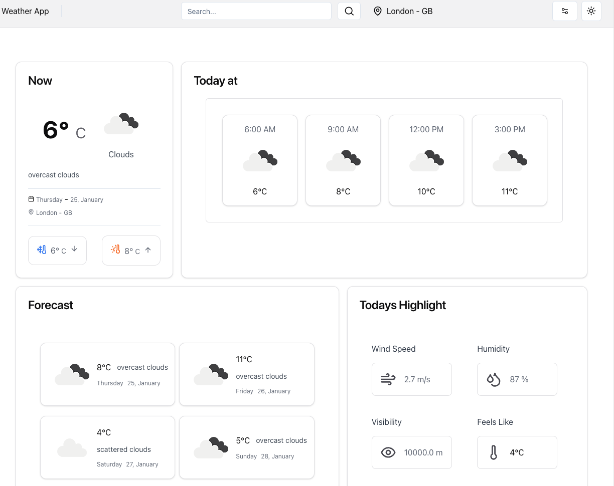

# Weather App 

The Weather App is an application where you can search for your desired location and check the current temperature at that place. You can also view the forecast for the upcoming days and hours. Additionally, there is an option to see highlights about the current weather. The application features a menu to switch between temperature units and measurements of your choice. It also supports a dark theme.



## Core Technologies:

- **Vite (5.0.8):**
   - A rapid development environment for React applications, offering fast builds and hot module replacement.

- **React (18.2.0) with TypeScript:**
   - Utilizing React for building user interfaces, enhanced by TypeScript for type safety.

## UI Components:

The Weather App relies on the **shadcn/ui** library for the user interface, offering:

- **Pre-built Components:**
  - **shadcn/ui** provides ready-to-use components, ensuring a consistent and visually appealing design.

- **Integration with Lucide React Icons:**
  - Seamless integration with **lucide-react** for easy use of SVG icons in the interface.

- **Tailwind CSS Integration:**
  - Components designed to work seamlessly with Tailwind CSS, providing flexibility in styling.

## Form Handling:

Form handling is managed through the powerful duo of **Zod** and **React Hook Form**:

- **Zod:**
  - A TypeScript-first schema declaration and validation library, ensuring data integrity.

- **React Hook Form:**
  - Simplifies form handling by providing hooks and utilities for managing form data and validation.

## Asynchronous Requests and State Management:

To handle asynchronous requests and manage states effectively, the Weather App utilizes:

- **Axios (1.6.5):**
  - A promise-based HTTP client simplifying the process of sending requests and handling responses.

- **@tanstack/react-query (5.17.19):**
  - A library providing hooks for managing state and fetching data, offering a powerful solution for asynchronous operations.

- **Context API:**
  - React's Context API is used for managing global state related to search terms and weather information.

## Linting:

The project employs Eslint for code linting and Prettier for code formatting, ensuring consistent and clean code.

## Additional Features:

- **Toggle Theme:**
  - The app includes a toggle for changing the theme, enhancing the user's visual experience.

- **Settings Menu:**
  - A menu of configuration options provides additional flexibility and customization.

## Instructions to Run the App:

Follow these steps to run the Weather App locally:

1. **Clone the Repository and Install Dependencies:**
   - Clone the repository and navigate to the project directory. Run `npm install` to install dependencies.
   ```bash
    git clone https://github.com/StefanyVasc/weather-app.2.0.git

    cd weather-app.2.0
    npm install
    ```

2. **Obtain OpenWeatherMap API Key:**
   - Create an account on [OpenWeatherMap](https://openweathermap.org/), obtain an API key.

3. **Create a Local `.env` File:**
   - In the root, create a `.env` file and add the API key as an environment variable.
   ```env
      VITE_API_KEY='your-api-key'
      VITE_API_URL='https://api.openweathermap.org/data/2.5/forecast'
    ```
4. **Run the Application:**
   - Execute `npm run dev` to start the app at [http://localhost:5173/](http://localhost:5173/).

Now, the Weather App is running locally, fetching data from OpenWeatherMap using environment variables. Keep your API key secure and avoid sharing it publicly.

## Tracker Time
- The creation of the UI with responsiveness and micro-interactions took approximately one full day. The development of the logic and functionality took an additional day.
